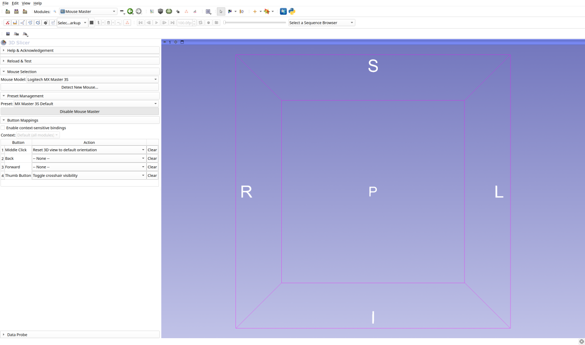

SlicerMouseMaster Documentation
================================

SlicerMouseMaster is a 3D Slicer extension for advanced mouse customization,
button remapping, and workflow optimization.

Features
--------

- **Button Remapping**: Assign custom actions to mouse buttons (back, forward, thumb, etc.)
- **Mouse Profiles**: Built-in support for popular mice with auto-detection
- **Workflow Presets**: Save and share button configurations for different tasks
- **Context-Sensitive Bindings**: Different mappings per Slicer module
- **Cross-Platform**: Works on Windows, macOS, and Linux

Quick Links
-----------

- :doc:`user-guide/quick-start` - Get started in 5 minutes
- :doc:`user-guide/button-mapping` - Configure your mouse buttons
- :doc:`user-guide/presets` - Save and share configurations
- :doc:`developer-guide/index` - Extend MouseMaster

.. toctree::
   :maxdepth: 1
   :caption: User Guide
   :titlesonly:

   user-guide/index
   user-guide/installation
   user-guide/quick-start
   user-guide/button-mapping
   user-guide/presets
   user-guide/context-bindings
   user-guide/troubleshooting

.. toctree::
   :maxdepth: 1
   :caption: Developer Guide
   :titlesonly:

   developer-guide/index
   developer-guide/architecture
   developer-guide/adding-actions
   developer-guide/adding-mice
   developer-guide/testing
   developer-guide/contributing

.. toctree::
   :maxdepth: 1
   :caption: Reference
   :titlesonly:

   reference/index
   reference/actions
   reference/presets

.. toctree::
   :maxdepth: 1
   :caption: Architecture Decisions
   :titlesonly:

   adr/index

Indices and tables
==================

* :ref:`genindex`
* :ref:`search`
