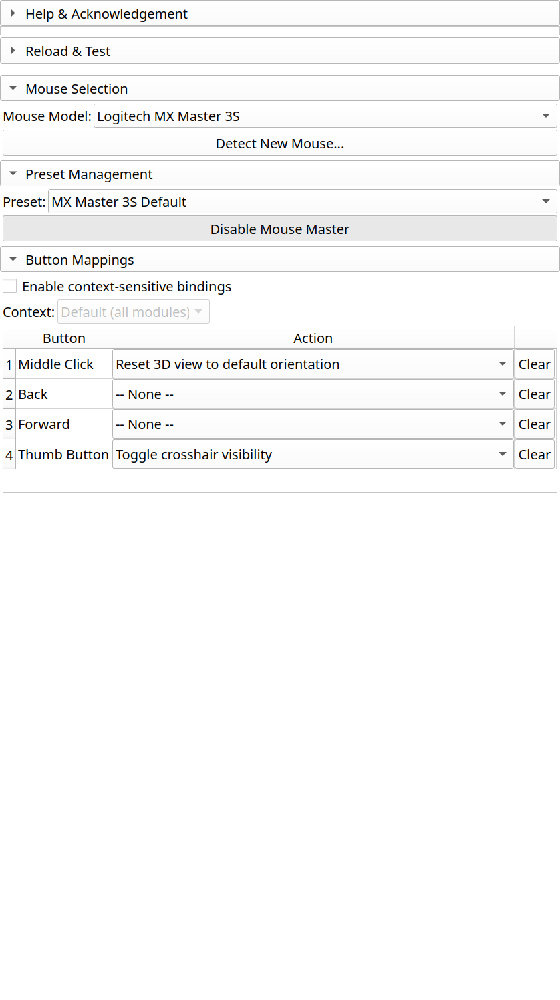

Button Mapping
==============

The button mapping table is where you assign actions to your mouse buttons.

Understanding the Interface
---------------------------

The mapping table shows:

- **Button**: The physical button on your mouse
- **Qt Code**: The internal button identifier (for debugging)
- **Action**: The currently assigned action
- **Remappable**: Whether this button can be customized

Mapping a Button
----------------

1. Find the button you want to configure
2. Click the **Action** dropdown for that button
3. Select an action from the list
4. Changes apply immediately

Available Actions
-----------------

**Navigation:**

- Reset 3D View
- Zoom In / Zoom Out
- Pan View
- Rotate View

**Editing:**

- Undo / Redo
- Delete Selected
- Toggle Crosshair

**Segment Editor:**

- Next/Previous Segment
- Toggle Effect (Paint/Erase)
- Apply Effect
- Show/Hide Segment

**Custom:**

- Run Python command
- Trigger menu action
- Keyboard shortcut

Default Bindings
----------------

For MX Master 3S/4:

.. list-table::
   :header-rows: 1

   * - Button
     - Default Action
     - Segment Editor Override
   * - Back
     - Undo
     - Previous Segment
   * - Forward
     - Redo
     - Next Segment
   * - Thumb
     - Toggle Crosshair
     - Toggle Paint/Erase
   * - Middle Click
     - Reset 3D View
     - (No override)

Non-Remappable Buttons
----------------------

Left and right click are essential for Slicer's core functionality and cannot
be remapped. MouseMaster focuses on extra buttons:

- Middle click / scroll wheel click
- Back button
- Forward button
- Thumb buttons
- Additional programmable buttons

Detecting Unknown Buttons
-------------------------

If you have a mouse with buttons not in the standard profiles:

1. Click "Detect New Mouse..."
2. Press each button when prompted
3. Name and save your custom profile
4. Map actions to your new buttons

See Also
--------

- :doc:`presets` - Save your button configurations
- :doc:`context-bindings` - Different mappings per module
- :doc:`/reference/actions` - Complete action reference
