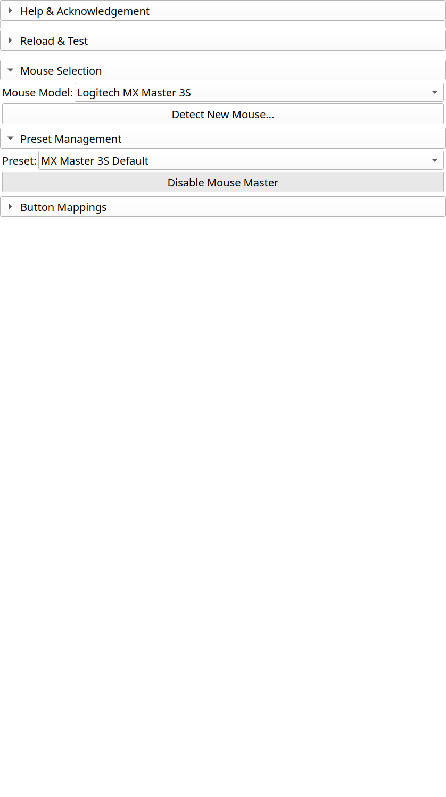

Presets
=======

Presets save your complete button configuration for easy switching and sharing.

Understanding Presets
---------------------

A preset contains:

- Button-to-action mappings
- Context-specific overrides (per-module bindings)
- Target mouse profile
- Metadata (name, description, author)

Preset Locations
----------------

**Built-in presets:**
  Installed with the extension, read-only.

**User presets:**
  Stored in your Slicer settings directory, editable.

Managing Presets
----------------

Creating a New Preset
^^^^^^^^^^^^^^^^^^^^^

1. Configure your button mappings
2. Click "Save As New Preset..."
3. Enter a name and optional description
4. Click Save

The preset is saved to your user presets directory.

Loading a Preset
^^^^^^^^^^^^^^^^

1. Select the preset from the dropdown
2. Click "Load Preset"
3. Your button mappings update immediately

Editing a Preset
^^^^^^^^^^^^^^^^

1. Load the preset
2. Modify button mappings as needed
3. Click "Save Preset" to overwrite, or "Save As..." for a new preset

Deleting a Preset
^^^^^^^^^^^^^^^^^

1. Select the preset
2. Click "Delete Preset"
3. Confirm deletion

.. note::
   Built-in presets cannot be deleted, but you can save a modified copy.

Sharing Presets
---------------

Exporting
^^^^^^^^^

1. Select the preset to share
2. Click "Export Preset..."
3. Choose a location and filename
4. Share the ``.json`` file

Importing
^^^^^^^^^

1. Click "Import Preset..."
2. Select a ``.json`` preset file
3. The preset appears in your dropdown

Community Presets
^^^^^^^^^^^^^^^^^

Browse and share presets with the community:

- `GitHub Discussions <https://github.com/benzwick/SlicerMouseMaster/discussions/categories/presets>`_
- Submit your presets via pull request to ``presets/community/``

Preset File Format
------------------

Presets are stored as JSON files:

.. code-block:: json

   {
     "id": "my_workflow",
     "name": "My Workflow",
     "version": "1.0",
     "mouseId": "logitech_mx_master_3s",
     "author": "Your Name",
     "mappings": {
       "back": {"action": "edit_undo"},
       "forward": {"action": "edit_redo"}
     },
     "contextMappings": {
       "SegmentEditor": {
         "back": {"action": "segment_previous"}
       }
     }
   }

For detailed format documentation, see :doc:`/reference/presets`.

Troubleshooting
---------------

**Preset not loading:**

- Validate JSON syntax
- Check ``mouseId`` matches your selected mouse
- Check Slicer console for error messages

**Changes not saving:**

- Verify write permissions to settings directory
- Try "Save As..." to a different location
- Check available disk space

See Also
--------

- :doc:`button-mapping` - Configure individual buttons
- :doc:`context-bindings` - Module-specific overrides
- :doc:`/reference/presets` - Preset format specification
